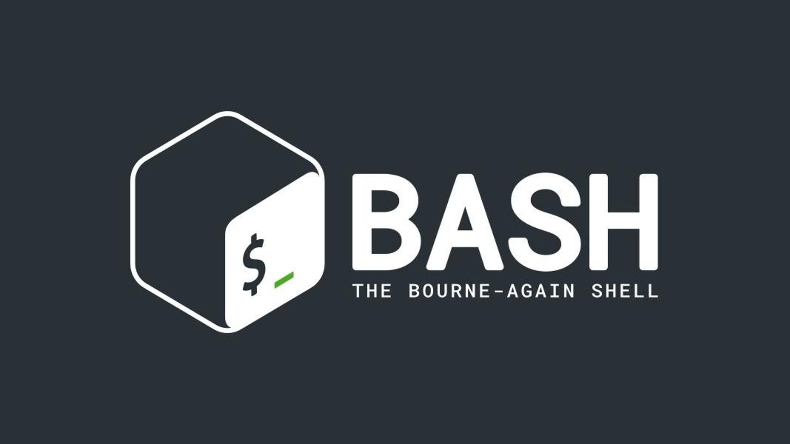

## **Bash - Bourne-again shell**

Bash scripting is a convenient way to automate tasks on Linux systems. As Linux administrators and DevOps professionals, we often perform repetitive tasks that require running multiple commands. Instead of executing these commands manually each time, we can use bash scripting to automate the process. Bash scripts allow us to save a series of commands in a file and execute them as needed, making our workflow more efficient and consistent.

bash is a command interpreter or a shell that we use in linux/inux system.
A command interpreter is ==a type of program that reads lines of text entered by a user and executes them to the operating system==.

So this learning has been divided into several number of classes.

Class 1 - Introduction
Class 2 - Hello World
Class 3 - Variables
Class 4 - Math Functions
Class 5 - If Statements
Class 6 - Exit Codes
Class 7 - While Loops
Class 8 - Universal Update Script
Class 9 - For Loops
Class 10 - Filesystem Locations for Scripts
Class 11 - Data Streams
Class 12 - Functions
Class 13 - Case statements
Class 14 - Scheduling Jobs (part1)
Class 15 - Scheduling Jobs (part2)
Class 16 - Arguments
Class 17 - Create a Backup Scripts
Class 18 - Closing

Prerequisites

Computer
Terminal
Linux Server

